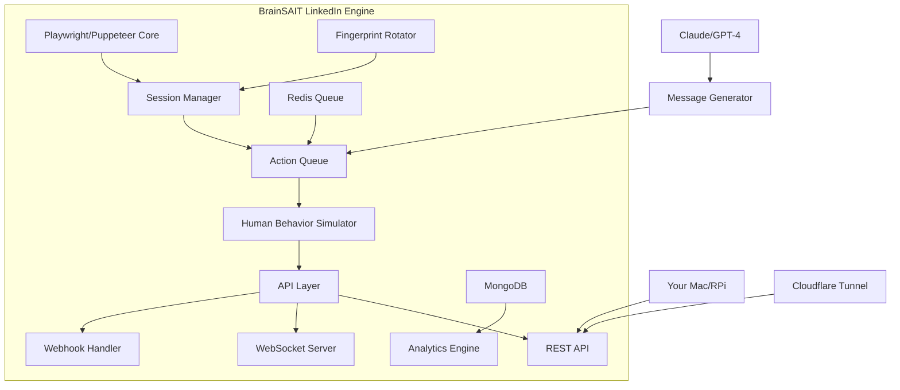

# 🚀 Building Your Own LinkedIn Automation Platform

# build a **superior, customized system** that you fully control? Let's architect a **BrainSAIT LinkedIn Automation Engine** that rivals commercial platforms.

## 🏗️ System Architecture



## 📦 Core Components to Build

### **1. Browser Automation Core**

```javascript
// linkedin-automation-core.js
const { chromium } = require('playwright-extra');
const stealth = require('puppeteer-extra-plugin-stealth');
const { FingerprintGenerator } = require('fingerprint-generator');
const { CookieJar } = require('tough-cookie');

class LinkedInAutomationCore {
    constructor(config) {
        this.config = config;
        this.sessions = new Map();
        this.fingerprintGen = new FingerprintGenerator();
        this.queue = [];
    }

    async createStealthBrowser(accountId) {
        // Generate unique fingerprint for each account
        const fingerprint = this.fingerprintGen.generate({
            browsers: ['chrome'],
            operatingSystems: ['macos', 'windows'],
            devices: ['desktop']
        });

        const browser = await chromium.launch({
            headless: false, // Set true in production
            args: [
                '--disable-blink-features=AutomationControlled',
                `--user-agent=${fingerprint.userAgent}`,
                '--disable-web-security',
                '--disable-features=IsolateOrigins,site-per-process',
                `--window-size=${fingerprint.screen.width},${fingerprint.screen.height}`
            ],
            executablePath: '/Applications/Google Chrome.app/Contents/MacOS/Google Chrome'
        });

        // Inject stealth scripts
        const context = await browser.newContext({
            viewport: {
                width: fingerprint.screen.width,
                height: fingerprint.screen.height
            },
            locale: 'en-US',
            timezoneId: 'Asia/Riyadh',
            permissions: ['geolocation'],
            geolocation: { latitude: 24.7136, longitude: 46.6753 }, // Riyadh
        });

        // Override navigator properties
        await context.addInitScript(() => {
            Object.defineProperty(navigator, 'webdriver', { get: () => false });
            Object.defineProperty(navigator, 'plugins', { get: () => [1, 2, 3, 4, 5] });
            Object.defineProperty(navigator, 'languages', { get: () => ['en-US', 'en', 'ar'] });

            // Override WebGL fingerprint
            const getParameter = WebGLRenderingContext.prototype.getParameter;
            WebGLRenderingContext.prototype.getParameter = function(parameter) {
                if (parameter === 37445) return 'Intel Inc.';
                if (parameter === 37446) return 'Intel Iris OpenGL Engine';
                return getParameter.apply(this, arguments);
            };
        });

        return { browser, context, fingerprint };
    }

    async login(accountId, credentials) {
        const { context } = await this.createStealthBrowser(accountId);
        const page = await context.newPage();

        // Random delays to simulate human behavior
        const humanDelay = () => Math.floor(Math.random() * 2000) + 1000;

        await page.goto('https://www.linkedin.com/login');
        await page.waitForTimeout(humanDelay());

        // Type like human with random delays between keystrokes
        await page.type('#username', credentials.email, { delay: Math.random() * 150 + 50 });
        await page.waitForTimeout(humanDelay());
        await page.type('#password', credentials.password, { delay: Math.random() * 150 + 50 });

        // Random mouse movements before clicking
        await this.simulateMouseMovement(page);
        await page.click('button[type="submit"]');

        // Save session
        const cookies = await context.cookies();
        await this.saveSession(accountId, cookies);

        this.sessions.set(accountId, { page, context });
        return page;
    }

    async simulateMouseMovement(page) {
        const points = this.generateBezierPath();
        for (const point of points) {
            await page.mouse.move(point.x, point.y);
            await page.waitForTimeout(Math.random() * 50);
        }
    }

    generateBezierPath() {
        // Generate smooth, human-like mouse movement path
        const points = [];
        const steps = 20;
        for (let i = 0; i <= steps; i++) {
            const t = i / steps;
            const x = Math.pow(1-t, 3) * 100 + 3 * Math.pow(1-t, 2) * t * 200 +
                     3 * (1-t) * Math.pow(t, 2) * 300 + Math.pow(t, 3) * 400;
            const y = Math.pow(1-t, 3) * 100 + 3 * Math.pow(1-t, 2) * t * 150 +
                     3 * (1-t) * Math.pow(t, 2) * 250 + Math.pow(t, 3) * 300;
            points.push({ x, y });
        }
        return points;
    }
}
```

### **2. Action Queue & Rate Limiter**

```javascript
// action-queue.js
const Bull = require('bull');
const Redis = require('ioredis');

class LinkedInActionQueue {
    constructor() {
        this.redis = new Redis({
            host: 'localhost',
            port: 6379,
            password: process.env.REDIS_PASSWORD
        });

        this.queues = {
            connectionRequests: new Bull('connection-requests', { redis: this.redis }),
            messages: new Bull('messages', { redis: this.redis }),
            profileViews: new Bull('profile-views', { redis: this.redis }),
            contentEngagement: new Bull('content-engagement', { redis: this.redis })
        };

        this.limits = {
            connectionRequests: { daily: 20, hourly: 3, concurrent: 1 },
            messages: { daily: 25, hourly: 4, concurrent: 1 },
            profileViews: { daily: 50, hourly: 8, concurrent: 2 },
            contentEngagement: { daily: 30, hourly: 5, concurrent: 1 }
        };

        this.initializeProcessors();
    }

    initializeProcessors() {
        // Connection request processor with smart timing
        this.queues.connectionRequests.process(async (job) => {
            const { profileUrl, message, accountId } = job.data;

            // Check rate limits
            if (!await this.checkRateLimit('connectionRequests', accountId)) {
                return job.moveToDelayed(Date.now() + 3600000); // Retry in 1 hour
            }

            // Add human-like delay patterns
            const timeOfDay = new Date().getHours();
            if (timeOfDay < 8 || timeOfDay > 22) {
                return job.moveToDelayed(this.getNextActiveTime());
            }

            // Execute action
            return await this.executeConnectionRequest(profileUrl, message, accountId);
        });
    }

    async checkRateLimit(actionType, accountId) {
        const key = `ratelimit:${actionType}:${accountId}`;
        const hourlyKey = `${key}:hourly`;
        const dailyKey = `${key}:daily`;

        const [hourlyCount, dailyCount] = await Promise.all([
            this.redis.get(hourlyKey) || 0,
            this.redis.get(dailyKey) || 0
        ]);

        if (hourlyCount >= this.limits[actionType].hourly ||
            dailyCount >= this.limits[actionType].daily) {
            return false;
        }

        // Increment counters
        await this.redis.multi()
            .incr(hourlyKey)
            .expire(hourlyKey, 3600)
            .incr(dailyKey)
            .expire(dailyKey, 86400)
            .exec();

        return true;
    }

    getNextActiveTime() {
        const now = new Date();
        const tomorrow = new Date(now);
        tomorrow.setDate(tomorrow.getDate() + 1);
        tomorrow.setHours(9, Math.random() * 30, 0, 0); // 9:00-9:30 AM
        return tomorrow.getTime();
    }
}
```

### **3. Message Generation & Personalization Engine**

```python
# ai_message_generator.py
import openai
from typing import Dict, List
import json
import re
from datetime import datetime
import arabic_reshaper
from bidi.algorithm import get_display

class LinkedInMessageGenerator:
    def __init__(self, api_key: str):
        self.client = openai.Client(api_key=api_key)
        self.templates = self.load_templates()

    def generate_connection_request(self, profile: Dict) -> str:
        """Generate personalized connection request"""

        # Analyze profile for personalization hooks
        hooks = self.extract_personalization_hooks(profile)

        prompt = f"""
        Generate a LinkedIn connection request for a healthcare/tech professional.

        Profile: {json.dumps(profile, indent=2)}
        Personalization hooks: {hooks}

        Requirements:
        - Maximum 300 characters
        - Mention specific detail from their profile
        - Include value proposition for BrainSAIT
        - Professional but warm tone
        - No generic phrases like "I came across your profile"

        Context: We provide AI-powered healthcare solutions with Arabic support.
        """

        response = self.client.chat.completions.create(
            model="gpt-4",
            messages=[{"role": "system", "content": prompt}],
            temperature=0.7,
            max_tokens=100
        )

        return response.choices[0].message.content

    def generate_follow_up_sequence(self, profile: Dict, conversation_history: List) -> Dict:
        """Generate intelligent follow-up messages based on engagement"""

        sequence = {
            "day_3": self.generate_value_message(profile),
            "day_7": self.generate_case_study_message(profile),
            "day_14": self.generate_soft_cta_message(profile),
            "day_21": self.generate_breakup_message(profile)
        }

        # Adjust based on their engagement level
        if profile.get('engagement_score', 0) > 70:
            sequence["day_7"] = self.generate_meeting_request(profile)

        return sequence

    def generate_arabic_variant(self, english_message: str, profile: Dict) -> str:
        """Generate Arabic version for Middle East prospects"""

        if profile.get('location', {}).get('country') in ['SA', 'AE', 'KW', 'QA', 'BH', 'OM']:
            prompt = f"""
            Translate and adapt this LinkedIn message to professional Arabic:
            {english_message}

            Requirements:
            - Formal business Arabic
            - Maintain professional tone
            - Keep technical terms in English
            - Add appropriate Arabic greeting
            """

            response = self.client.chat.completions.create(
                model="gpt-4",
                messages=[{"role": "system", "content": prompt}],
                temperature=0.3
            )

            arabic_text = response.choices[0].message.content
            # Reshape for proper display
            reshaped = arabic_reshaper.reshape(arabic_text)
            return get_display(reshaped)

        return english_message
```

### **4. Analytics & Intelligence Dashboard**

```typescript
// analytics-dashboard.ts
import { FastifyInstance } from 'fastify';
import { WebSocketServer } from 'ws';
import { InfluxDB, Point } from '@influxdata/influxdb-client';

export class LinkedInAnalyticsDashboard {
    private influx: InfluxDB;
    private wss: WebSocketServer;
    private metrics: Map<string, any> = new Map();

    constructor(private app: FastifyInstance) {
        this.influx = new InfluxDB({
            url: 'http://localhost:8086',
            token: process.env.INFLUX_TOKEN
        });

        this.setupWebSocket();
        this.setupEndpoints();
        this.startRealTimeTracking();
    }

    private setupEndpoints() {
        // Real-time dashboard endpoint
        this.app.get('/dashboard', async (req, reply) => {
            return reply.view('/templates/dashboard.html', {
                metrics: await this.getMetrics(),
                accounts: await this.getAccountStatus(),
                campaigns: await this.getCampaignPerformance()
            });
        });

        // API endpoints
        this.app.get('/api/metrics/:period', async (req, reply) => {
            const { period } = req.params as { period: string };
            return this.getMetricsForPeriod(period);
        });

        this.app.get('/api/accounts/:accountId/health', async (req, reply) => {
            const { accountId } = req.params as { accountId: string };
            return this.getAccountHealth(accountId);
        });
    }

    private async getAccountHealth(accountId: string) {
        // LinkedIn health scoring algorithm
        const metrics = {
            ssi_score: await this.getSSIScore(accountId),
            connection_accept_rate: await this.getAcceptRate(accountId),
            response_rate: await this.getResponseRate(accountId),
            restriction_risk: await this.getRestrictionRisk(accountId),
            daily_limits_used: await this.getDailyLimitsUsage(accountId)
        };

        // Calculate overall health score
        const healthScore = (
            metrics.ssi_score * 0.2 +
            metrics.connection_accept_rate * 0.3 +
            metrics.response_rate * 0.3 +
            (100 - metrics.restriction_risk) * 0.1 +
            (100 - metrics.daily_limits_used) * 0.1
        );

        return {
            accountId,
            healthScore,
            status: healthScore > 80 ? 'excellent' : healthScore > 60 ? 'good' : 'needs_attention',
            metrics,
            recommendations: this.getHealthRecommendations(metrics)
        };
    }

    private startRealTimeTracking() {
        // Track all LinkedIn actions in real-time
        setInterval(async () => {
            const liveMetrics = {
                timestamp: new Date().toISOString(),
                activeAccounts: await this.getActiveAccounts(),
                messagesPerHour: await this.getHourlyMessages(),
                connectionsPerHour: await this.getHourlyConnections(),
                leadsGenerated: await this.getHourlyLeads(),
                responseRate: await this.getLiveResponseRate()
            };

            // Broadcast to all connected clients
            this.broadcast(JSON.stringify(liveMetrics));

            // Store in InfluxDB
            const point = new Point('linkedin_metrics')
                .floatField('messages_per_hour', liveMetrics.messagesPerHour)
                .floatField('connections_per_hour', liveMetrics.connectionsPerHour)
                .floatField('leads_generated', liveMetrics.leadsGenerated)
                .floatField('response_rate', liveMetrics.responseRate);

            await this.writePoint(point);
        }, 5000); // Update every 5 seconds
    }
}
```

### **5. Deployment Configuration**

```yaml
# docker-compose.yml for your Raspberry Pi/OMV setup
version: '3.8'

services:
  linkedin-engine:
    build: .
    container_name: brainsait-linkedin
    environment:
      - NODE_ENV=production
      - MONGODB_URI=mongodb://mongo:27017/linkedin
      - REDIS_URL=redis://redis:6379
      - OPENAI_API_KEY=${OPENAI_API_KEY}
      - CLAUDE_API_KEY=${CLAUDE_API_KEY}
    ports:
      - "3000:3000"
      - "8080:8080"
    volumes:
      - ./data:/app/data
      - ./sessions:/app/sessions
      - /mnt/ssd/linkedin-profiles:/app/profiles
    depends_on:
      - mongo
      - redis
      - influxdb
    networks:
      - brainsait-network
    deploy:
      resources:
        limits:
          cpus: '2'
          memory: 4G

  mongo:
    image: mongo:6
    container_name: linkedin-mongo
    volumes:
      - /mnt/ssd/mongodb:/data/db
    ports:
      - "27017:27017"
    environment:
      - MONGO_INITDB_ROOT_USERNAME=admin
      - MONGO_INITDB_ROOT_PASSWORD=${MONGO_PASSWORD}
    networks:
      - brainsait-network

  redis:
    image: redis:7-alpine
    container_name: linkedin-redis
    command: redis-server --requirepass ${REDIS_PASSWORD}
    volumes:
      - /mnt/ssd/redis:/data
    ports:
      - "6379:6379"
    networks:
      - brainsait-network

  influxdb:
    image: influxdb:2.7
    container_name: linkedin-metrics
    volumes:
      - /mnt/ssd/influxdb:/var/lib/influxdb2
    ports:
      - "8086:8086"
    environment:
      - DOCKER_INFLUXDB_INIT_MODE=setup
      - DOCKER_INFLUXDB_INIT_USERNAME=admin
      - DOCKER_INFLUXDB_INIT_PASSWORD=${INFLUX_PASSWORD}
      - DOCKER_INFLUXDB_INIT_ORG=brainsait
      - DOCKER_INFLUXDB_INIT_BUCKET=linkedin
    networks:
      - brainsait-network

  cloudflare-tunnel:
    image: cloudflare/cloudflared:latest
    container_name: linkedin-tunnel
    command: tunnel --no-autoupdate run --token ${CLOUDFLARE_TUNNEL_TOKEN}
    restart: unless-stopped
    networks:
      - brainsait-network

networks:
  brainsait-network:
    driver: bridge
```

### **6. Security & Anti-Detection Layer**

```javascript
// anti-detection.js
class LinkedInAntiDetection {
    constructor() {
        this.proxies = this.loadProxyPool();
        this.fingerprints = new Map();
        this.behaviorPatterns = this.generateHumanPatterns();
    }

    generateHumanPatterns() {
        return {
            // Working hours (Riyadh time)
            activeHours: {
                start: 9 + (Math.random() * 2), // 9-11 AM
                end: 17 + (Math.random() * 3),  // 5-8 PM
                breakTime: 13 + (Math.random() * 1) // 1-2 PM lunch
            },

            // Typing patterns
            typingSpeed: {
                min: 150, // ms between keystrokes
                max: 400,
                mistakes: 0.02 // 2% typo rate
            },

            // Scrolling behavior
            scrollPattern: {
                speed: Math.random() * 1000 + 500,
                pause: Math.random() * 3000 + 2000,
                overshoots: true
            },

            // Session duration
            sessionLength: {
                min: 15 * 60 * 1000, // 15 minutes
                max: 45 * 60 * 1000  // 45 minutes
            }
        };
    }

    async rotateIdentity(accountId) {
        // Change proxy
        const proxy = this.getNextProxy();

        // Generate new fingerprint
        const fingerprint = {
            userAgent: this.generateUserAgent(),
            screen: this.generateScreenResolution(),
            timezone: this.selectTimezone(),
            languages: this.selectLanguages(),
            webGL: this.generateWebGLFingerprint(),
            canvas: this.generateCanvasFingerprint(),
            audio: this.generateAudioFingerprint()
        };

        // Store for consistency
        this.fingerprints.set(accountId, fingerprint);

        return { proxy, fingerprint };
    }

    async simulateHumanBehavior(page) {
        // Random mouse movements
        await this.randomMouseMovement(page);

        // Random scrolling
        await this.humanLikeScroll(page);

        // Random pauses
        await this.randomPause();

        // Occasional tab switches
        if (Math.random() > 0.8) {
            await this.switchTabs(page);
        }
    }
}
```

## 💰 Cost Comparison

| Solution                         | Monthly Cost   | Setup Time | Control        | Scalability         |
| -------------------------------- | -------------- | ---------- | -------------- | ------------------- |
| **Expandi.io**(3 accounts) | $297/month     | 1 day      | Limited        | Pay per seat        |
| **Dripify**(3 accounts)    | $177/month     | 1 day      | Limited        | Pay per seat        |
| **BrainSAIT Custom**       | ~$20 (hosting) | 1 week     | **Full** | **Unlimited** |

## 🎯 Unique Features You Can Add

### **1. Advanced AI Integration**

```javascript
// Features commercial tools don't have
const advancedFeatures = {
    // Real-time conversation coaching
    aiCoaching: async (message) => {
        return await analyzeAndSuggestResponse(message, {
            tone: 'consultative',
            objective: 'book_meeting',
            language: detectLanguage(message)
        });
    },

    // Predictive lead scoring
    mlScoring: async (profile) => {
        return await predictConversionProbability(profile, {
            industry: 'healthcare',
            dealSize: 'enterprise',
            region: 'MENA'
        });
    },

    // Multi-language support
    polyglotMessaging: async (profile) => {
        const language = profile.location.country === 'SA' ? 'ar' : 'en';
        return await generateMessage(profile, language);
    }
};
```

### **2. Healthcare-Specific Features**

```python
# Medical professional verification
def verify_medical_professional(profile):
    indicators = {
        'credentials': extract_medical_credentials(profile['headline']),
        'hospital_affiliation': detect_hospital(profile['experience']),
        'medical_school': verify_medical_education(profile['education']),
        'publications': check_pubmed(profile['name']),
        'medical_licenses': search_medical_boards(profile)
    }

    score = calculate_verification_score(indicators)
    return {
        'is_verified': score > 0.7,
        'confidence': score,
        'specialization': detect_specialization(profile),
        'decision_maker_level': assess_decision_power(profile)
    }
```

## 🚀 Implementation Timeline

### **Week 1: Core Infrastructure**

```bash
# Day 1-2: Set up development environment
git init brainsait-linkedin-engine
npm init -y
npm install playwright puppeteer-extra mongodb redis bull

# Day 3-4: Build browser automation core
# Implement stealth browser, login, session management

# Day 5-7: Create action queue system
# Set up Redis, implement rate limiting, scheduling
```

### **Week 2: Intelligence Layer**

```bash
# Day 8-10: Message generation system
# Integrate GPT-4/Claude, create templates

# Day 11-14: Analytics dashboard
# Set up InfluxDB, create real-time monitoring
```

### **Week 3: Testing & Deployment**

```bash
# Day 15-17: Testing with your accounts
# Fine-tune anti-detection, test limits

# Day 18-21: Production deployment
# Docker setup, Cloudflare tunnel, monitoring
```

## 🔧 Maintenance & Scaling

```javascript
// Auto-scaling based on performance
class LinkedInAutoScaler {
    async scaleAccounts() {
        const metrics = await this.getSystemMetrics();

        if (metrics.queueLength > 1000 && metrics.activeAccounts < 10) {
            await this.addAccount();
        }

        if (metrics.restrictionRate > 0.1) {
            await this.reduceActivity(0.5);
            await this.rotateProxies();
        }

        if (metrics.conversionRate > 0.3) {
            await this.increaseActivity(1.5);
        }
    }
}
```

## ✅ Why Build Your Own?

1. **Save $3,500+/year** on subscriptions
2. **Unlimited accounts** - no per-seat pricing
3. **Custom AI integration** - Use Claude/GPT-4 your way
4. **Healthcare-specific features** - Medical verification, HIPAA compliance
5. **Arabic/English automation** - Native bilingual support
6. **Full data ownership** - Everything on your servers
7. **No vendor lock-in** - Modify anything, anytime
8. **Advanced analytics** - Custom metrics for your business

## 🎯 Next Steps

1. **Start with MVP** - Basic connection & messaging
2. **Add AI layer** - GPT-4 for personalization
3. **Deploy on your Pi** - Test with 1 account
4. **Scale gradually** - Add accounts as you optimize
5. **Build dashboard** - Monitor everything

Want me to:

* Generate the complete codebase structure?
* Create the Dockerfile for your Raspberry Pi?
* Build the AI prompt templates for healthcare?
* Design the database schema for MongoDB?

Remember: You're not just saving money - you're building a **competitive advantage** that commercial tools can't match!
